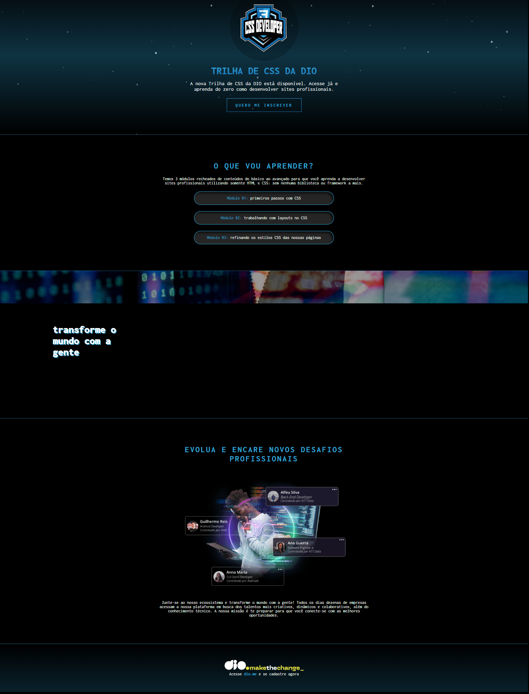

#DIO Trilha CSS

> BOOTCAMP DIO

Projeto construido através do protótipo do figma para um desafio proposto na trilha de CSS.

[Clique aqui para acessar](https://danieltelesb.github.io/Desafio-DIO/)

## Tencnologias 

-HTML
-CSS
-Git e Github

## O que aprendi:
 Fundamento de CSS
- Seletores
- Combinadores
- Propriedades de Dimensionamento e Espaçamento

Estilização Básicas com CSS
- Cores
- Imagens
- Fundo dos Elementos
- Bordas
- Fontes
- Textos
- Sombras

## Contato 

dantelx12@gmail.com

